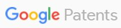

# 🎨 비즈벨 스타일 파트너 로고 적용 가이드

## ✅ 완성된 효과

### 기본 상태 (Before Hover)
```
로고: 흑백 + 어두움 (grayscale 100%, opacity 0.5)
```

### 마우스 오버 (After Hover)
```
로고: 풀컬러 + 밝게 (grayscale 0%, opacity 1)
     + 약간 확대 (scale 1.08)
```

---

## 📁 필요한 파일

### 이미지 파일 (7개)
✅ `kipris.png` - 한국 특허청
✅ `uspto.png` - 미국 특허청
✅ `europeanpatentoffice.png` - 유럽 특허청
✅ `googlepatent.png` - Google Patents
✅ `jplatpat.png` - 일본 특허청
✅ `patentsearchandanalysis.png` - 중국 특허
✅ `designview.png` - 디자인 DB

**위치:** 프로젝트 루트 또는 `/images` 폴더

---

## 🔧 적용 방법

### 1단계: CSS 추가 (index.html의 `<head>` 안에)

```html
<style>
/* Official Data Partners - 비즈벨 스타일 */
.partner-logo-wrapper {
    display: flex;
    align-items: center;
    justify-content: center;
    padding: 1.5rem;
    transition: all 0.3s cubic-bezier(0.4, 0, 0.2, 1);
}

.partner-logo {
    max-height: 50px;
    width: auto;
    max-width: 160px;
    filter: grayscale(100%) brightness(0.4);
    opacity: 0.5;
    transition: all 0.4s cubic-bezier(0.4, 0, 0.2, 1);
}

.partner-logo:hover {
    filter: grayscale(0%) brightness(1);
    opacity: 1;
    transform: scale(1.08);
}
</style>
```

### 2단계: HTML 섹션 추가 (원하는 위치에)

**권장 위치:**
- Hero 섹션 바로 아래
- Features 섹션 바로 위

```html
<section class="py-16 bg-white border-t border-neutral-100">
    <div class="max-w-6xl mx-auto px-6">
        <!-- 타이틀 -->
        <div class="text-center mb-12">
            <p class="text-sm font-semibold text-neutral-500 uppercase tracking-wider mb-2">
                Official Data Partners
            </p>
            <h2 class="text-2xl font-bold text-black">
                신뢰할 수 있는 글로벌 데이터베이스 연동
            </h2>
        </div>
        
        <!-- 로고 그리드 -->
        <div class="grid grid-cols-2 md:grid-cols-4 lg:grid-cols-7 gap-8 items-center">
            <div class="partner-logo-wrapper">
                
            </div>
            <div class="partner-logo-wrapper">
                
            </div>
            <div class="partner-logo-wrapper">
                
            </div>
            <div class="partner-logo-wrapper">
                
            </div>
            <div class="partner-logo-wrapper">
                
            </div>
            <div class="partner-logo-wrapper">
                
            </div>
            <div class="partner-logo-wrapper">
                
            </div>
        </div>
        
        <!-- 통계 (선택사항) -->
        <div class="mt-12 flex justify-center gap-8 flex-wrap">
            <div class="text-center">
                <p class="text-3xl font-bold text-primary">420만+</p>
                <p class="text-sm text-neutral-600">검색 가능 특허</p>
            </div>
            <div class="text-center">
                <p class="text-3xl font-bold text-primary">7개국</p>
                <p class="text-sm text-neutral-600">글로벌 데이터베이스</p>
            </div>
            <div class="text-center">
                <p class="text-3xl font-bold text-primary">실시간</p>
                <p class="text-sm text-neutral-600">데이터 업데이트</p>
            </div>
        </div>
    </div>
</section>
```

---

## 🎨 CSS 세부 설명

### 1. 기본 상태 (Grayscale)

```css
filter: grayscale(100%) brightness(0.4);
opacity: 0.5;
```

- `grayscale(100%)` → 완전 흑백
- `brightness(0.4)` → 40% 밝기로 어둡게
- `opacity: 0.5` → 50% 투명도

### 2. Hover 상태 (Color)

```css
filter: grayscale(0%) brightness(1);
opacity: 1;
transform: scale(1.08);
```

- `grayscale(0%)` → 컬러 복원
- `brightness(1)` → 100% 원래 밝기
- `opacity: 1` → 불투명
- `scale(1.08)` → 8% 확대

### 3. 전환 효과

```css
transition: all 0.4s cubic-bezier(0.4, 0, 0.2, 1);
```

- 0.4초 동안 부드럽게 전환
- cubic-bezier로 자연스러운 이징

---

## 📐 반응형 그리드

### Desktop (1024px+)
```
7개 로고 1줄 (grid-cols-7)
```

### Tablet (768px ~ 1023px)
```
4개씩 2줄 (grid-cols-4)
```

### Mobile (~767px)
```
2개씩 4줄 (grid-cols-2)
```

---

## 🎯 커스터마이징

### 로고 크기 조정

```css
.partner-logo {
    max-height: 60px;    /* 기본: 50px */
    max-width: 180px;    /* 기본: 160px */
}
```

### 어두움 정도 조정

```css
.partner-logo {
    filter: grayscale(100%) brightness(0.3);  /* 더 어둡게 */
    /* 또는 */
    filter: grayscale(100%) brightness(0.6);  /* 덜 어둡게 */
}
```

### 확대 효과 조정

```css
.partner-logo:hover {
    transform: scale(1.05);   /* 덜 확대 */
    /* 또는 */
    transform: scale(1.15);   /* 더 확대 */
}
```

### 전환 속도 조정

```css
.partner-logo {
    transition: all 0.3s ease;   /* 더 빠르게 */
    /* 또는 */
    transition: all 0.6s ease;   /* 더 느리게 */
}
```

---

## 🔍 문제 해결

### 문제 1: 로고가 너무 큼
```css
.partner-logo {
    max-height: 40px;  /* 50px에서 줄임 */
}
```

### 문제 2: 로고가 너무 어두움
```css
.partner-logo {
    filter: grayscale(100%) brightness(0.5);  /* 0.4에서 0.5로 */
}
```

### 문제 3: 호버 효과가 안 보임
- 브라우저 캐시 삭제: `Ctrl + F5`
- CSS가 `<head>` 안에 있는지 확인
- class 이름이 정확한지 확인

### 문제 4: 이미지가 안 보임
- 이미지 경로 확인: `src="kipris.png"` or `src="images/kipris.png"`
- 파일 이름 대소문자 확인 (Linux는 구분함)

---

## 📊 비즈벨과 비교

### 비즈벨 스타일
```
✅ Grayscale → Color
✅ Opacity 변화
✅ Scale 확대
✅ Smooth transition
```

### FTOGuard (이 구현)
```
✅ Grayscale 100% → 0%
✅ Brightness 0.4 → 1
✅ Opacity 0.5 → 1
✅ Scale 1.0 → 1.08
✅ Transition 0.4s cubic-bezier
```

**결과:** 비즈벨과 동일한 효과! 🎉

---

## 🚀 배포 체크리스트

- [ ] 7개 이미지 파일 업로드 확인
- [ ] CSS 코드 `<head>` 안에 추가
- [ ] HTML 섹션 원하는 위치에 추가
- [ ] 브라우저에서 hover 효과 테스트
- [ ] 모바일/태블릿 반응형 테스트
- [ ] 이미지 로딩 속도 확인

---

**완료! 이제 비즈벨처럼 멋진 파트너 로고 섹션이 생겼습니다!** 🎨✨
