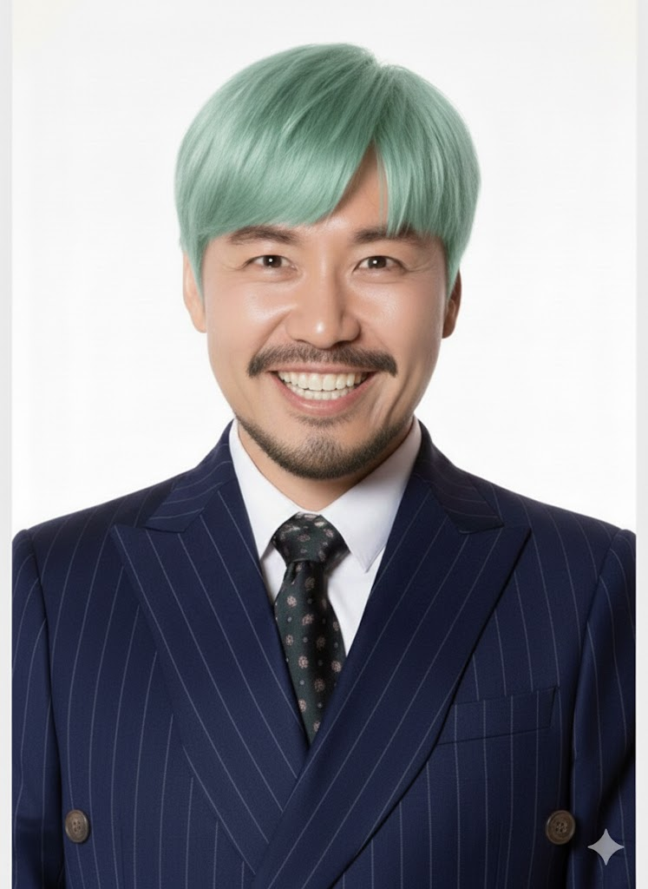
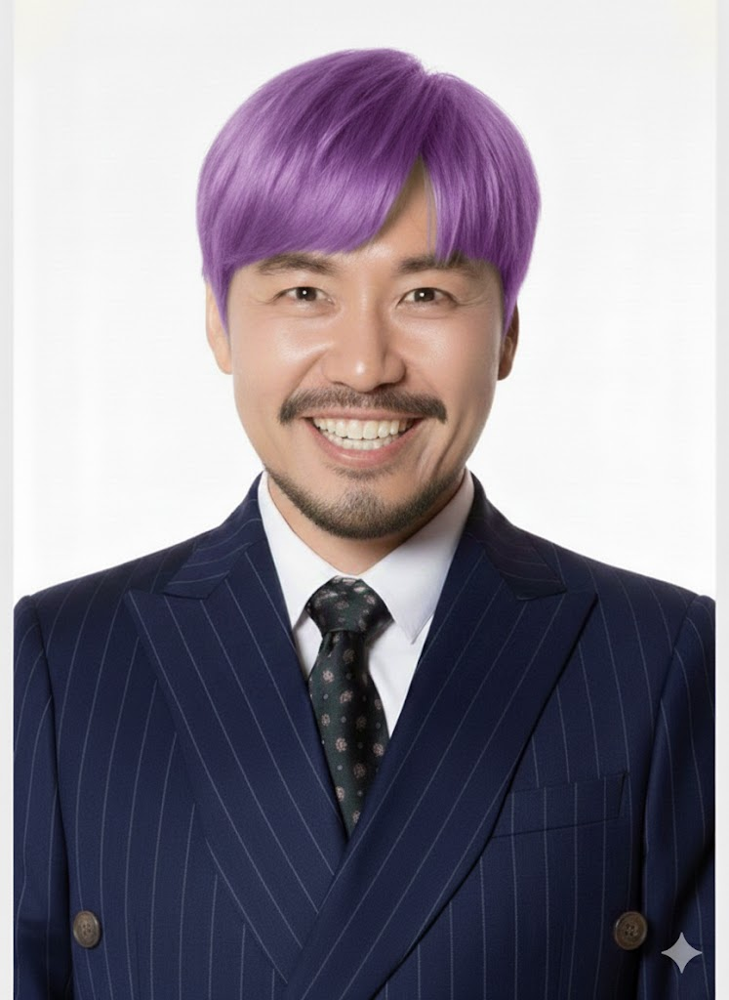
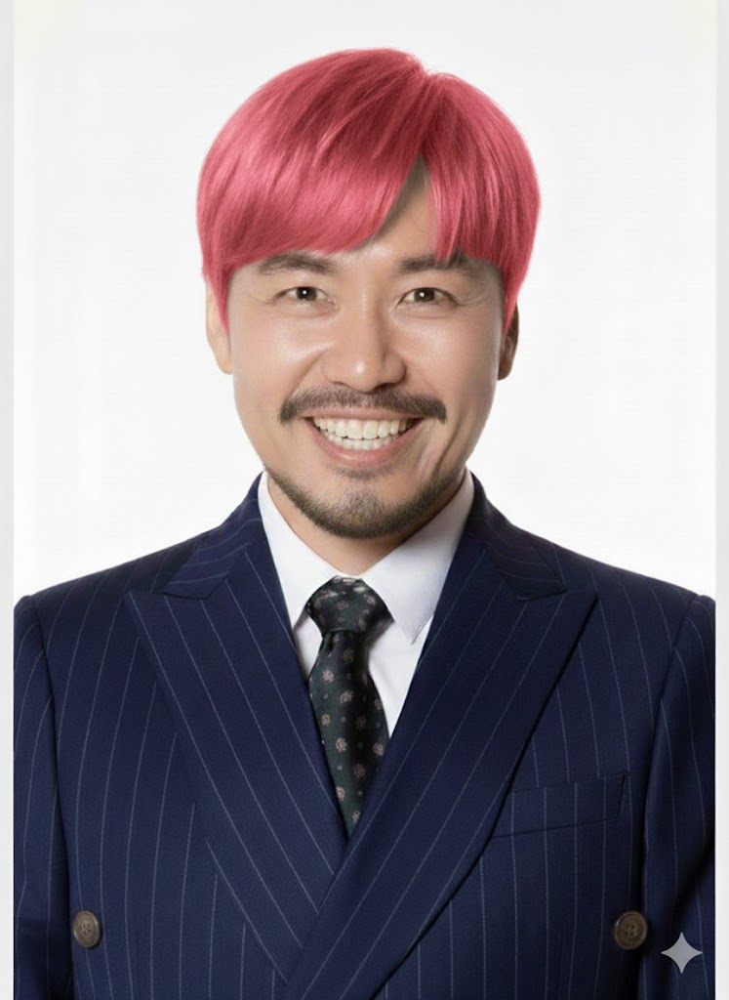
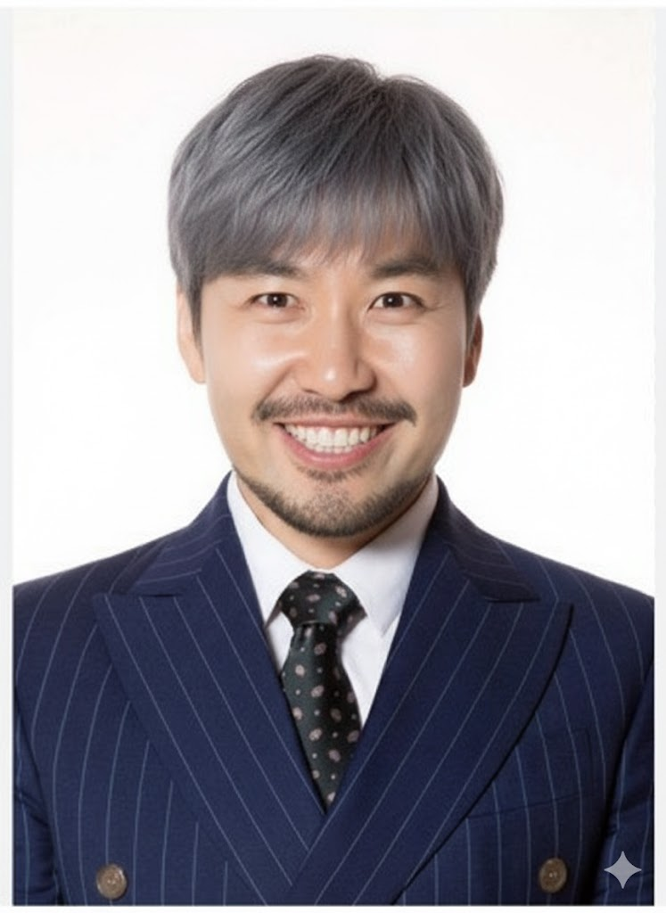
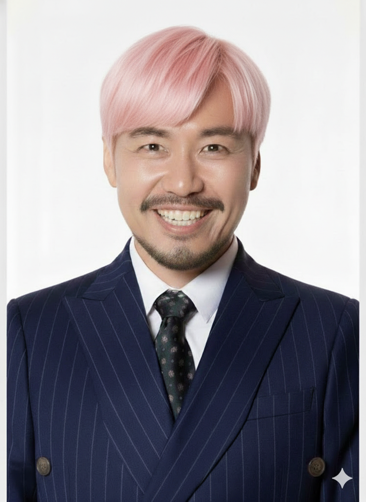

<div align="center">

[](https://www.python.org/)
[](https://fastapi.tiangolo.com/)
[](https://www.mysql.com/)
[](https://aws.amazon.com/)
[](https://www.runpod.io/)

**개발 기간:** 2026.01.09 ~ 2026.03.11

</div>

---

## 목차

1. [프로젝트 개요](#1-프로젝트-개요)
2. [팀 소개](#2-팀-소개)
3. [주요 기능](#3-주요-기능)
4. [기술 스택](#4-기술-스택)
5. [시스템 아키텍처](#5-시스템-아키텍처)
6. [RAG 파이프라인](#6-rag-파이프라인)
7. [sLLM 파인튜닝](#7-sllm-파인튜닝)
8. [디자인 챗봇](#8-디자인-챗봇)
9. [프로젝트 구조](#9-프로젝트-구조)
10. [설치 및 실행](#10-설치-및-실행)
11. [API 명세](#11-api-명세)
12. [성능 평가](#12-성능-평가)
13. [기대 효과](#13-기대-효과)

---

## 1. 프로젝트 개요

### FTO(Freedom To Operate)란?

> **실시의 자유** — 내가 출시하려는 제품이 타인의 특허·디자인권을 침해하는가를 사전에 분석하는 작업

FTO 분석을 하지 않고 제품을 출시할 경우 아래와 같은 법적 리스크가 발생합니다:

| 리스크 | 설명 |
|--------|------|
| 🚫 **특허침해 금지청구** | 제품 판매·생산 즉시 중단 명령 |
| 💰 **손해배상 청구** | 수억~수백억 규모 배상 가능 |
| ⚖️ **형사처벌** | 고의 침해 시 7년 이하 징역 또는 1억 원 이하 벌금 |
| 🚢 **수출입 차단** | 세관에서 침해 제품 통관 금지 |

### 문제점

기존 FTO 분석의 Pain Point:

- ⏱️ 평균 **2주 이상** 소요
- 💸 변리사 의뢰 시 **수백만 원** 비용 발생
- ⚖️ 청구항 해석에 **전문적인 법적 지식** 필요

### 해결 방안 — FTOGuard

> **누구나 쓸 수 있는 FTO 판단 보조 AI 챗봇**

- **검색 자동화** — 키워드 조합·검색식 생성을 AI가 대신
- **후보 특허 검출** — 관련 특허를 자동으로 추려 우선순위 제시
- **청구항 분석 보조** — 법적 해석의 진입장벽을 낮춰 초기 검토 가능
- **의사결정 지원** — 전문가 의뢰 전 "이 제품이 위험한가?"를 먼저 판단

---

## 2. 팀 소개

<table align="center">
  <tr>
    <td align="center"><br><b>김태빈</b></td>
    <td align="center"><br><b>박다정</b></td>
    <td align="center"><br><b>강민지</b></td>
    <td align="center"><br><b>김나현</b></td>
    <td align="center"><br><b>조준상</b></td>
    <td align="center"><br><b>최유정</b></td>
  </tr>
</table>

---

## 3. 주요 기능

### 3.1 특허/실용신안 FTO 검토

사용자가 제품 구성을 입력하면, 관련 특허의 청구항과 **1:1 구성 대비표**를 출력하고 침해 가능성을 판단합니다.

**출력 예시:**

| 특허 구성 | 사용자 제품 구성 | 대응 여부 |
|-----------|-----------------|-----------|
| 돔형으로 성형된 | 볼록한 형태 | ✅ 대응 |
| 분말 아이섀도우 | 눈화장 | ✅ 대응 |
| 디이소스테아릴 말레이트 5~30 중량% | 디이소스테아릴 말레이트 5% | ✅ 대응 |
| 방부제 및 향 0.02~5 중량% | 1,2-헥산다이올 5%, 향료 1% (총 6%) | ❌ 미대응 (균등론 검토) |

### 3.2 디자인 FTO 검토

도면·사진을 업로드하면 등록된 디자인 특허 중 형태가 유사한 것 **10건을 자동 검색**하고, 유사/비유사 포인트를 AI가 설명합니다.

**출력 예시:**

> 전체적인 실루엣과 노즐 형태가 유사하나, 하단부 곡률 차이로 비유사 요소 존재 — 출시 전 전문가 검토 권장

---

## 4. 기술 스택

### Backend
| 기술 | 용도 |
|------|------|
| **FastAPI** | REST API 서버 |
| **SQLAlchemy 2.0** | ORM |
| **MySQL 8.4** | 메타데이터 관리 (AWS RDS) |
| **ChromaDB** | Vector Database |
| **JWT** | 인증 (python-jose) |

### AI/ML
| 기술 | 용도 |
|------|------|
| **Qwen2.5-14B** | 특허 FTO 분석 sLLM (LoRA 파인튜닝) |
| **Qwen2.5-VL-7B** | 디자인 이미지 분석 VLM |
| **KURE-v1** | 한국어 특화 임베딩 |
| **CLIP ViT-B/32** | 디자인 이미지 임베딩 |
| **BM25** | Sparse 검색 |
| **vLLM** | LLM 추론 엔진 |
| **LangGraph** | 에이전트 워크플로우 |

### Infrastructure
| 기술 | 용도 |
|------|------|
| **AWS EC2** | 애플리케이션 서버 |
| **AWS RDS** | MySQL 데이터베이스 |
| **AWS S3** | 디자인 이미지 저장 |
| **RunPod Serverless** | GPU 추론 서버 |
| **NGINX** | 리버스 프록시 |

### Frontend
| 기술 | 용도 |
|------|------|
| **HTML5 / CSS3** | UI 구조 및 스타일 |
| **Vanilla JavaScript** | 클라이언트 로직 |
| **Marked.js** | 마크다운 렌더링 |

---

## 5. 시스템 아키텍처

```
┌─────────────────────────────────────────────────────────────────────┐
│                              Client                                  │
│                    (HTML/CSS/JavaScript)                            │
└─────────────────────────────┬───────────────────────────────────────┘
                              │ HTTPS
                              ▼
┌─────────────────────────────────────────────────────────────────────┐
│                             NGINX                                    │
│                       (Reverse Proxy)                               │
└─────────────────────────────┬───────────────────────────────────────┘
                              │
                              ▼
┌─────────────────────────────────────────────────────────────────────┐
│                     FastAPI Backend (EC2)                            │
│  ┌─────────────┐  ┌─────────────┐  ┌─────────────┐  ┌────────────┐ │
│  │  Auth API   │  │  Chat API   │  │ Design API  │  │Project API │ │
│  └─────────────┘  └─────────────┘  └─────────────┘  └────────────┘ │
└────────┬────────────────┬────────────────┬──────────────────────────┘
         │                │                │
         ▼                ▼                ▼
┌─────────────┐  ┌─────────────────┐  ┌─────────────┐
│  AWS RDS    │  │  ChromaDB       │  │   AWS S3    │
│  (MySQL)    │  │  (Vector DB)    │  │  (Images)   │
└─────────────┘  └─────────────────┘  └─────────────┘
                          │
                          ▼
         ┌────────────────────────────────────┐
         │       RunPod Serverless (GPU)       │
         │  ┌──────────────┐ ┌──────────────┐ │
         │  │ Qwen2.5-14B  │ │Qwen2.5-VL-7B │ │
         │  │   (특허)     │ │  (디자인)    │ │
         │  └──────────────┘ └──────────────┘ │
         └────────────────────────────────────┘
```

---

## 6. RAG 파이프라인

### 특허 FTO 분석 파이프라인

```
Step 1. Pre-Filter  →  Step 2. Hybrid RAG  →  Step 3. sLLM
   7.8만 → 2,000개         Top 10 특허            FTO 리스크 판단
```

#### Step 1 — Pre-filter

사용자 질문에서 키워드를 추출한 뒤, RDS MySQL 키워드 테이블에서 **7.8만 건 → 2,000건**으로 후보를 좁힙니다.

```
예시: "헤스페리딘이 포함된 미백 화장품"
→ 키워드 추출: "헤스페리딘", "미백", "화장품"
→ Pre-Filter DB에서 OR 매칭 → 키워드 매칭 횟수 기준 정렬
→ 상위 2,000개 Child 문서의 Parent 특허 반환
```

#### Step 2 — Hybrid Search

| 방식 | 모델/기술 | 설명 |
|------|----------|------|
| **Dense** | KURE-v1 + ChromaDB | 한국어 특화 임베딩 + 코사인 유사도 |
| **Sparse** | BM25 | 토큰 기반 키워드 매칭 |
| **Fusion** | RRF | Dense 0.5 : Sparse 0.5 (Context Recall **94.3%**) |

#### Step 3 — sLLM 분석

파인튜닝된 **Qwen2.5-14B**가 구성 대비표 + 침해 분석 + 결론을 생성합니다.

---

## 7. sLLM 파인튜닝

### Why sLLM?

| 비교 항목 | 일반 LLM (API) | sLLM (On-Premise) |
|-----------|----------------|-------------------|
| **보안** | 데이터 외부 전송 → 기밀 유출 위험 | 자체 서버 운영 → 데이터 유출 없음 |
| **도메인 특화** | 범용 텍스트 기반, 특허 법률 표현에 취약 | 파인튜닝으로 청구항 해석 능력 확보 |

### 학습 데이터

- **Gemini-2.0-flash**로 Synthetic Data 생성
- 도메인 전문가 검수 후 **21,694건** 확보
- Train/Test 8:2 층화 샘플링

| 라벨 | 건수 | 비율 |
|------|------|------|
| 침해 | 6,694 | 30.9% |
| 비침해 | 5,977 | 27.6% |
| 침해_전문가 | 4,526 | 20.9% |
| 애매 | 4,497 | 20.7% |

### 파인튜닝 소형 모델 vs Base 대형 모델 비교

| 비교 | 파인튜닝 소형 모델 | Base 대형 모델 | 성능 차이 |
|------|-------------------|----------------|-----------|
| Phase 1 | **1.5B FT (86.2%)** | 3B Base (30.1%) | +56.1%p |
| Phase 2 | **3B FT (89.5%)** | 7B Base (31.8%) | +57.7%p |
| Phase 3 | **7B FT (92.8%)** | 14B Base (46.3%) | +46.5%p |

> 💡 **핵심 인사이트:** 파인튜닝된 1.5B 모델이 파인튜닝 안 한 3B 모델보다 **56%p 높은 정확도**를 보임.
>
> → **"도메인 특화 파인튜닝이 모델 파라미터 규모보다 중요하다"**

### 모델 크기별 성능 (파인튜닝 후)

| 모델 | 정확도 |
|------|--------|
| Qwen2.5-1.5B FT | 86.2% |
| Qwen2.5-3B FT | 89.5% |
| Qwen2.5-7B FT | 92.8% |
| **Qwen2.5-14B FT** | **94.3%** |

### 학습 기술

- **QLoRA** — 4bit 양자화 + LoRA 어댑터 (14B 모델: ~28GB → ~7GB)
- **vLLM** — PagedAttention 기반 고효율 추론

---

## 8. 디자인 챗봇

### 데이터

- 르카르노 분류 **9-01** (화장품 용기) 도메인
- KIPRIS API에서 **8,139건** 수집
- Canny Edge Detection으로 스케치 변환
- CLIP 임베딩 → ChromaDB 저장 (**21,829건**)

### LangGraph 워크플로우

```
[입력] → [라우터]
  ├─ image → [VLM 분석] → [벡터 검색] → ★interrupt★ → [상세 비교] → [리포트] → END
  └─ text  → [LLM + Tools(웹검색, DB검색)] → END
```

| 단계 | 기능 |
|------|------|
| analyze_image | VLM으로 이미지 형상 특징 추출 |
| image_search | 하이브리드 검색으로 유사 디자인 Top 10 |
| show_results | 사용자 선택 대기 (interrupt) |
| detailed_compare | 선택 디자인과 상세 비교 |
| generate_report | FTO 판단 리포트 생성 |

---

## 9. 프로젝트 구조

```
SKN20-FINAL-2TEAM/
├── FRONTEND/                   # 프론트엔드 정적 파일
│   ├── index.html              # 메인 페이지
│   ├── login.html              # 로그인
│   ├── signup.html             # 회원가입
│   ├── patent-chat.html        # 특허 FTO 채팅
│   ├── design-chat.html        # 디자인 분석
│   ├── mypage.html             # 마이페이지
│   └── project.html            # 프로젝트 관리
│
├── backend/                    # FastAPI 백엔드
│   ├── app/
│   │   ├── main.py             # 앱 진입점
│   │   ├── config.py           # 환경설정
│   │   ├── database.py         # DB 연결
│   │   ├── routers/            # API 라우터
│   │   │   ├── auth.py         # 인증 API
│   │   │   ├── chat.py         # 특허 FTO API
│   │   │   ├── design.py       # 디자인 분석 API
│   │   │   └── project.py      # 프로젝트 API
│   │   ├── models/             # SQLAlchemy 모델
│   │   ├── schemas/            # Pydantic 스키마
│   │   └── services/           # 비즈니스 로직
│   └── requirements.txt
│
├── rag/                        # RAG 파이프라인
│   ├── search/
│   │   ├── retriever.py        # 하이브리드 검색
│   │   └── pipeline.py         # 검색 파이프라인
│   ├── backend_adapter.py      # 백엔드 연동
│   └── generate.py             # sLLM 응답 생성
│
├── design/                     # 디자인 챗봇
│   └── src/
│       └── design_chatbot.py   # LangGraph 워크플로우
│
└── sql/                        # SQL 스키마
    └── fto_schema.sql
```

---

## 10. 설치 및 실행

### 요구사항

- Python 3.10+
- MySQL 8.4
- CUDA 지원 GPU (추론용)

### 설치

```bash
# 저장소 클론
git clone https://github.com/SKNETWORKS-FAMILY-AICAMP/SKN20-FINAL-2TEAM.git
cd SKN20-FINAL-2TEAM

# 의존성 설치
pip install -r requirements_all.txt

# 환경변수 설정
cp backend/.env.example backend/.env
# .env 파일 편집하여 DB, AWS, RunPod 설정
```

### 실행

```bash
# 백엔드 서버 실행
cd backend
uvicorn app.main:app --host 0.0.0.0 --port 8080 --reload

# API 문서 확인
# http://localhost:8080/docs
```

---

## 11. API 명세

### 인증 (`/api/auth`)

| Method | Endpoint | 설명 |
|--------|----------|------|
| POST | `/signup` | 회원가입 |
| POST | `/login` | 로그인 (JWT 반환) |
| GET | `/me` | 현재 사용자 정보 |
| PUT | `/password` | 비밀번호 변경 |

### 특허 FTO (`/api/chat`)

| Method | Endpoint | 설명 |
|--------|----------|------|
| POST | `/message` | FTO 분석 요청 |
| POST | `/search` | 특허 검색 (RAG) |
| POST | `/analyze-patent` | 개별 특허 분석 |
| POST | `/finalize` | 분석 결과 저장 |
| GET | `/analysis/{id}` | 분석 결과 조회 |

### 디자인 분석 (`/api/analysis/design`)

| Method | Endpoint | 설명 |
|--------|----------|------|
| POST | `/image` | 이미지 업로드 + 유사 디자인 검색 |
| POST | `/select` | 디자인 선택 + FTO 리포트 생성 |
| POST | `/text` | 텍스트 질문 (멀티턴) |
| GET | `/session/{id}` | 세션 히스토리 조회 |

---

## 12. 성능 평가

### RAG 검색 성능

| 설정 | Dense | Sparse | Context Recall |
|------|:-----:|:------:|:--------------:|
| Dense:Sparse = 1:1 | 0.5 | 0.5 | **94.3%** |

### sLLM 분석 성능

| 지표 | 점수 |
|------|------|
| **Context Precision** | 0.889 / 1 |
| **Answer Relevance** | 0.748 / 1 |
| **라벨 분류 정확도** | 94.3% |

### 디자인 검색 성능

| 지표 | 결과 |
|------|------|
| **HitRate@10** | 57.89% |

---

## 13. 기대 효과

### 정량적 기대효과

| 항목 | 기존 방식 | FTOGuard |
|------|-----------|----------|
| FTO 소요 시간 | 수일~수주 | **10분 내** |
| 비용 | 100만~2,000만 원 | **최소화** |
| 전문가 낭비 시간 | 주당 6~8시간 | **대폭 단축** |

### 정성적 기대효과

- ✅ 특허 전담팀 업무 효율화
- ✅ 중소기업·스타트업 접근성 확대
- ✅ 디자인 특허 리스크 선제 대응

### 확장 가능성

- 🔄 도메인 확장 (IPC/로카르노 분류 추가)
- 🔄 실시간 데이터 업데이트 (KIPRIS API 연동)
- 🔄 판례 DB 연동 (리스크 점수 정량화)

---

<div align="center">

**© 2026 FTOGuard Team (긍마) | SKN AI 20기**

</div>
