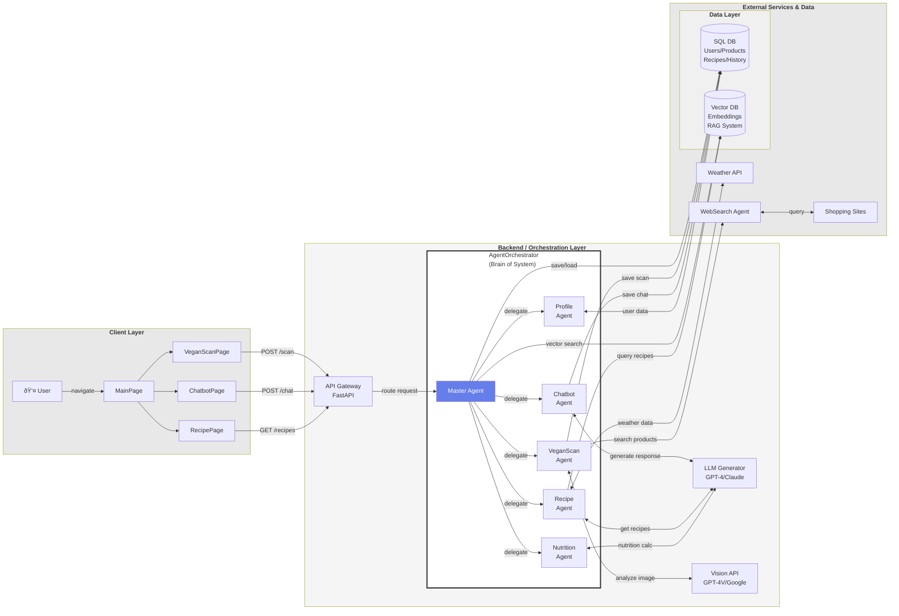
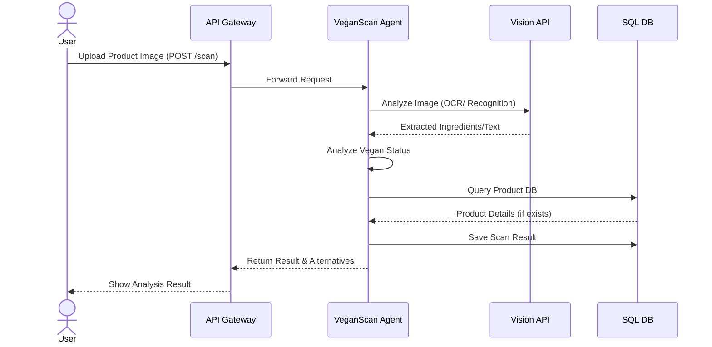
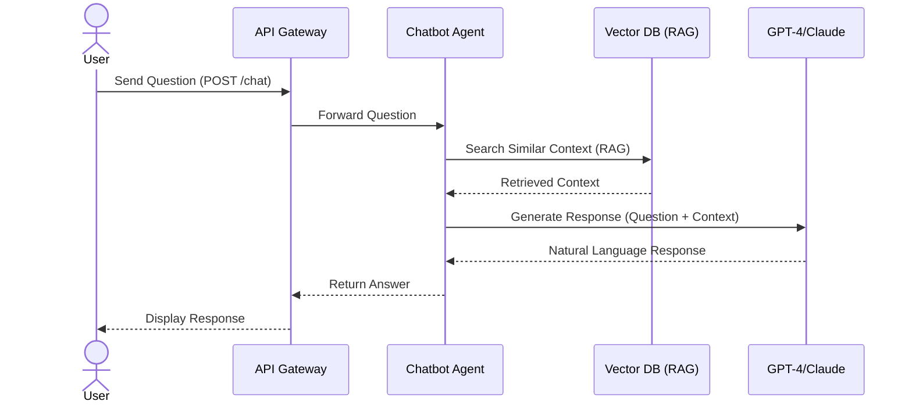
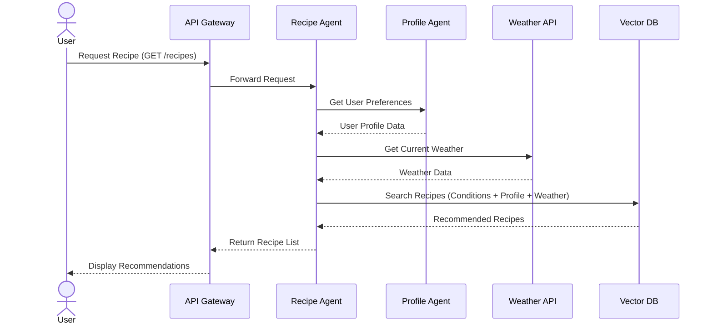

# Vegan Life Curator - System Diagrams

## 1. System Architecture

```mermaid
graph LR
    subgraph Client["<b>Client Layer</b>"]
        User[👤 User]
        MainPage[MainPage]
        ScanPage[VeganScanPage]
        ChatPage[ChatbotPage]
        RecipePage[RecipePage]
    end

    subgraph Backend["<b>Backend / Orchestration Layer</b>"]
        Gateway[API Gateway<br/>FastAPI]
        
        subgraph Orchestrator["AgentOrchestrator<br/>(Brain of System)"]
            Master[Master Agent]
            VeganAgent[VeganScan<br/>Agent]
            ChatAgent[Chatbot<br/>Agent]
            RecipeAgent[Recipe<br/>Agent]
            ProfileAgent[Profile<br/>Agent]
            NutriAgent[Nutrition<br/>Agent]
        end
        
        LLM[LLM Generator<br/>GPT-4/Claude]
        Vision[Vision API<br/>GPT-4V/Google]
    end

    subgraph External["<b>External Services & Data</b>"]
        Weather[Weather API]
        Shopping[Shopping Sites]
        WebSearch[WebSearch Agent]
        
        subgraph DataLayer["<b>Data Layer</b>"]
            SQL[(SQL DB<br/>Users/Products<br/>Recipes/History)]
            Vector[(Vector DB<br/>Embeddings<br/>RAG System)]
        end
    end

    User -->|navigate| MainPage
    MainPage --> ScanPage
    MainPage --> ChatPage
    MainPage --> RecipePage
    
    ScanPage -->|POST /scan| Gateway
    ChatPage -->|POST /chat| Gateway
    RecipePage -->|GET /recipes| Gateway
    
    Gateway -->|route request| Master
    
    Master -->|delegate| VeganAgent
    Master -->|delegate| ChatAgent
    Master -->|delegate| RecipeAgent
    Master -->|delegate| ProfileAgent
    Master -->|delegate| NutriAgent
    
    VeganAgent <-->|analyze image| Vision
    ChatAgent <-->|generate response| LLM
    RecipeAgent <-->|get recipes| LLM
    RecipeAgent <-->|weather data| Weather
    NutriAgent <-->|nutrition calc| LLM
    
    VeganAgent -->|search products| WebSearch
    WebSearch <-->|query| Shopping
    
    Master -->|save/load| SQL
    Master -->|vector search| Vector
    
    VeganAgent -->|save scan| SQL
    ChatAgent -->|save chat| SQL
    RecipeAgent -->|query recipes| Vector
    ProfileAgent <-->|user data| SQL

    style Client fill:#e8e8e8
    style Backend fill:#f5f5f5
    style External fill:#e8e8e8
    style Orchestrator fill:#fff,stroke:#333,stroke-width:3px
    style DataLayer fill:#f0f0f0
    style Master fill:#667eea,color:#fff
```

## 2. Sequence Diagrams

### 2.1 Product Scan Flow

```mermaid
sequenceDiagram
    actor User
    participant Gateway as API Gateway
    participant VeganAgent as VeganScan Agent
    participant Vision as Vision API
    participant SQL as SQL DB

    User->>Gateway: Upload Product Image (POST /scan)
    Gateway->>VeganAgent: Forward Request
    VeganAgent->>Vision: Analyze Image (OCR/ Recognition)
    Vision-->>VeganAgent: Extracted Ingredients/Text
    VeganAgent->>VeganAgent: Analyze Vegan Status
    VeganAgent->>SQL: Query Product DB
    SQL-->>VeganAgent: Product Details (if exists)
    VeganAgent->>SQL: Save Scan Result
    VeganAgent-->>Gateway: Return Result & Alternatives
    Gateway-->>User: Show Analysis Result
```

### 2.2 Chatbot Consultation Flow

```mermaid
sequenceDiagram
    actor User
    participant Gateway as API Gateway
    participant ChatAgent as Chatbot Agent
    participant Vector as Vector DB (RAG)
    participant LLM as GPT-4/Claude

    User->>Gateway: Send Question (POST /chat)
    Gateway->>ChatAgent: Forward Question
    ChatAgent->>Vector: Search Similar Context (RAG)
    Vector-->>ChatAgent: Retrieved Context
    ChatAgent->>LLM: Generate Response (Question + Context)
    LLM-->>ChatAgent: Natural Language Response
    ChatAgent-->>Gateway: Return Answer
    Gateway-->>User: Display Response
```

### 2.3 Recipe Recommendation Flow

```mermaid
sequenceDiagram
    actor User
    participant Gateway as API Gateway
    participant RecipeAgent as Recipe Agent
    participant Profile as Profile Agent
    participant Weather as Weather API
    participant Vector as Vector DB

    User->>Gateway: Request Recipe (GET /recipes)
    Gateway->>RecipeAgent: Forward Request
    RecipeAgent->>Profile: Get User Preferences
    Profile-->>RecipeAgent: User Profile Data
    RecipeAgent->>Weather: Get Current Weather
    Weather-->>RecipeAgent: Weather Data
    RecipeAgent->>Vector: Search Recipes (Conditions + Profile + Weather)
    Vector-->>RecipeAgent: Recommended Recipes
    RecipeAgent-->>Gateway: Return Recipe List
    Gateway-->>User: Display Recommendations
```
